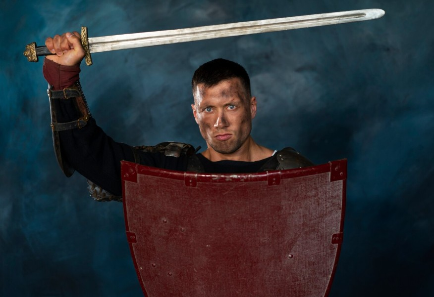

# AI Object Detection

An AI-powered object detection application developed using Python, PyTorch, Transformers, and the DETR (DEtection TRansformer) model from Hugging Face.

The application detects and identifies objects in images using state-of-the-art computer vision transformers.

---

## Features

* AI object detection
* Bounding box generation
* Confidence score detection
* Image annotation with labels
* Transformer-based computer vision
* Hugging Face model integration

---

## Technologies Used

* Python
* PyTorch
* Transformers
* Hugging Face Hub
* Pillow (PIL)
* NumPy

---

## AI Model

This project uses the following model from Hugging Face:

* `facebook/detr-resnet-50`

DETR (DEtection TRansformer) is a transformer-based object detection model developed by Facebook AI Research (Meta AI).

---

## Installation

Clone the repository:

```bash id="evqt8u"
git clone https://github.com/rafaelraah/objectDetection.git
```

Enter the project folder:

```bash id="pgtxhh"
cd objectDetection
```

Create a virtual environment:

```bash id="ehwrf2"
python -m venv .venv
```

Activate the environment:

### Windows

```bash id="22hbce"
.venv\Scripts\activate
```

### Linux / Mac

```bash id="1o5ldx"
source .venv/bin/activate
```

Install dependencies:

```bash id="ufg5es"
pip install -r requirements.txt
```

---

## Run the Application

```bash id="3bdx4y"
python detect_object.py
```

---

## Example Output

```txt id="0d6tkv"
Detected chair with confidence 0.972
Detected person with confidence 0.998
Detected laptop with confidence 0.945
```

---

## Project Structure

```txt id="9wznqz"
├── detect_object.py
├── requirements.txt
├── README.md
└── images/
```

---

## Screenshots

Add screenshots of the application here.

Example:

```md id="1m98ln"

```

---

## How It Works

1. The image is loaded using Pillow.
2. The DETR processor prepares the image for the model.
3. The transformer model performs object detection.
4. Bounding boxes and labels are generated.
5. The final image is rendered with annotations.

---

## License

This project is for educational and experimental purposes.

Please verify the license terms of the AI model before commercial use.

---

## Author

Rafael Nascimento

Software Architect specialized in:

* .NET
* C#
* JavaScript
* Python
* Java
* Microservices
* APIs
* DevOps
* Docker
* Kubernetes
* AI applications
* Computer Vision
* Academic systems development
* Digital game development
